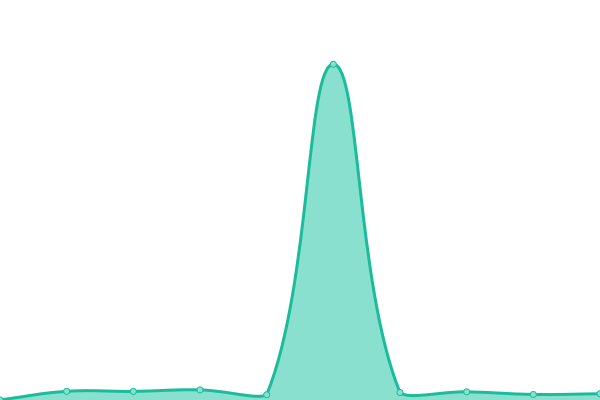

# [📈 Live Status](https://hernanvinson.github.io/upptime): <!--live status--> **🟩 All systems operational**

This repository contains the open-source uptime monitor and status page for [Hernan](https://hernanvinson.github.io/upptime), powered by [Upptime](https://github.com/upptime/upptime).

With [Upptime](https://upptime.js.org), you can get your own unlimited and free uptime monitor and status page, powered entirely by a GitHub repository. We use [Issues](https://github.com/hernanvinson/upptime/issues) as incident reports, [Actions](https://github.com/hernanvinson/upptime/actions) as uptime monitors, and [Pages](https://hernanvinson.github.io/upptime) for the status page.

<!--start: status pages-->
<!-- This summary is generated by Upptime (https://github.com/upptime/upptime) -->
<!-- Do not edit this manually, your changes will be overwritten -->
<!-- prettier-ignore -->
| URL | Status | History | Response Time | Uptime |
| --- | ------ | ------- | ------------- | ------ |
|  [Google](https://google.com/) | 🟩 Up | [google.yml](https://github.com/HernanVinson/upptime/commits/HEAD/history/google.yml) | 

 92ms
     
 | 

<a href="https://HernanVinson.github.io/upptime/history/google">99.98%</a>
    

|  [Rtdm Fabric](https://rtdm.vinsoncloud.com) | 🟩 Up | [rtdm-fabric.yml](https://github.com/HernanVinson/upptime/commits/HEAD/history/rtdm-fabric.yml) | 

 134ms
     
 | 

<a href="https://HernanVinson.github.io/upptime/history/rtdm-fabric">100.00%</a>
    

|  [Freddo Vcloud](http://freddo.app.vinsoncloud.com) | 🟩 Up | [freddo-vcloud.yml](https://github.com/HernanVinson/upptime/commits/HEAD/history/freddo-vcloud.yml) | 

 89ms
     
 | 

<a href="https://HernanVinson.github.io/upptime/history/freddo-vcloud">100.00%</a>
    

|  [Freddo Vcloud Stream Connector 2](https://streamrtdmconnector2.vinsoncloud.com/api/Health) | 🟩 Up | [freddo-vcloud-stream-connector-2.yml](https://github.com/HernanVinson/upptime/commits/HEAD/history/freddo-vcloud-stream-connector-2.yml) | 

 72ms
     
 | 

<a href="https://HernanVinson.github.io/upptime/history/freddo-vcloud-stream-connector-2">100.00%</a>
    

|  [Host VinsonCloud](http://host.ws.vinsoncloud.com/Ui/Login) | 🟩 Up | [host-vinson-cloud.yml](https://github.com/HernanVinson/upptime/commits/HEAD/history/host-vinson-cloud.yml) | 

 96ms
     
 | 

<a href="https://HernanVinson.github.io/upptime/history/host-vinson-cloud">100.00%</a>
    

|  [RtView VinsonCloud](http://rtview.vinsoncloud.com/) | 🟩 Up | [rt-view-vinson-cloud.yml](https://github.com/HernanVinson/upptime/commits/HEAD/history/rt-view-vinson-cloud.yml) | 

 130ms
     
 | 

<a href="https://HernanVinson.github.io/upptime/history/rt-view-vinson-cloud">100.00%</a>
    

|  [Rt VinsonCloud](http://rt.vinsoncloud.com/) | 🟩 Up | [rt-vinson-cloud.yml](https://github.com/HernanVinson/upptime/commits/HEAD/history/rt-vinson-cloud.yml) | 

 70ms
     
 | 

<a href="https://HernanVinson.github.io/upptime/history/rt-vinson-cloud">100.00%</a>
    

|  [Deli Vinsoncloud](http://deli.vinsoncloud.com/) | 🟩 Up | [deli-vinsoncloud.yml](https://github.com/HernanVinson/upptime/commits/HEAD/history/deli-vinsoncloud.yml) | 

 90ms
     
 | 

<a href="https://HernanVinson.github.io/upptime/history/deli-vinsoncloud">100.00%</a>
    

|  [Stream Connector](https://streamvconnector.vinsoncloud.com/api/health) | 🟩 Up | [stream-connector.yml](https://github.com/HernanVinson/upptime/commits/HEAD/history/stream-connector.yml) | 

 57ms
     
 | 

<a href="https://HernanVinson.github.io/upptime/history/stream-connector">100.00%</a>
    

<!--end: status pages-->

[**Visit our status website →**](https://hernanvinson.github.io/upptime)

## 📄 License

- Powered by: [Upptime](https://github.com/upptime/upptime)
- Code: [MIT](./LICENSE) © [Hernan](https://hernanvinson.github.io/upptime)
- Data in the `./history` directory: [Open Database License](https://opendatacommons.org/licenses/odbl/1-0/)
