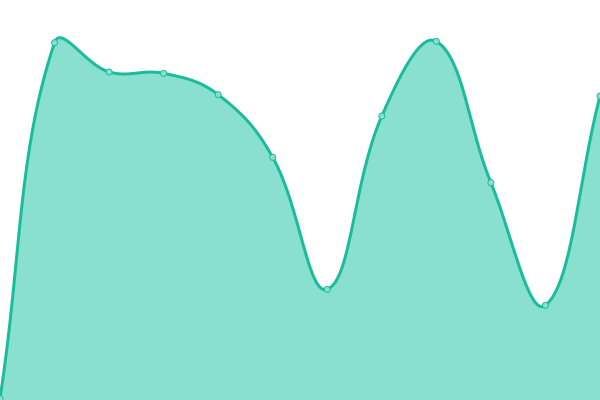

# [📈 Live Status](https://hernanvinson.github.io/upptime): <!--live status--> **🟧 Partial outage**

This repository contains the open-source uptime monitor and status page for [Hernan](https://hernanvinson.github.io/upptime), powered by [Upptime](https://github.com/upptime/upptime).

With [Upptime](https://upptime.js.org), you can get your own unlimited and free uptime monitor and status page, powered entirely by a GitHub repository. We use [Issues](https://github.com/hernanvinson/upptime/issues) as incident reports, [Actions](https://github.com/hernanvinson/upptime/actions) as uptime monitors, and [Pages](https://hernanvinson.github.io/upptime) for the status page.

<!--start: status pages-->
<!-- This summary is generated by Upptime (https://github.com/upptime/upptime) -->
<!-- Do not edit this manually, your changes will be overwritten -->
<!-- prettier-ignore -->
| URL | Status | History | Response Time | Uptime |
| --- | ------ | ------- | ------------- | ------ |
|  [Rtdm Fabric](https://rtdm.vinsoncloud.com) | 🟩 Up | [rtdm-fabric.yml](https://github.com/HernanVinson/upptime/commits/HEAD/history/rtdm-fabric.yml) | 

 582ms
     
 | 

<a href="https://HernanVinson.github.io/upptime/history/rtdm-fabric">100.00%</a>
    

|  [Rtdm Fabric AppRunner](https://fabric.vinsoncloud.com) | 🟩 Up | [rtdm-fabric-app-runner.yml](https://github.com/HernanVinson/upptime/commits/HEAD/history/rtdm-fabric-app-runner.yml) | 

 144ms
     
 | 

<a href="https://HernanVinson.github.io/upptime/history/rtdm-fabric-app-runner">100.00%</a>
    

|  [Freddo Vcloud](http://freddo.app.vinsoncloud.com) | 🟩 Up | [freddo-vcloud.yml](https://github.com/HernanVinson/upptime/commits/HEAD/history/freddo-vcloud.yml) | 

 393ms
     
 | 

<a href="https://HernanVinson.github.io/upptime/history/freddo-vcloud">100.00%</a>
    

|  [Reportes Vinson(Vinson Reporting)](https://reportes.vinson.com.ar/) | 🟩 Up | [reportes-vinson-vinson-reporting.yml](https://github.com/HernanVinson/upptime/commits/HEAD/history/reportes-vinson-vinson-reporting.yml) | 

 643ms
     
 | 

<a href="https://HernanVinson.github.io/upptime/history/reportes-vinson-vinson-reporting">98.09%</a>
    

|  [Host VinsonCloud](http://host.ws.vinsoncloud.com/Ui/Login) | 🟩 Up | [host-vinson-cloud.yml](https://github.com/HernanVinson/upptime/commits/HEAD/history/host-vinson-cloud.yml) | 

 160ms
     
 | 

<a href="https://HernanVinson.github.io/upptime/history/host-vinson-cloud">100.00%</a>
    

|  [RtView VinsonCloud](http://rtview.vinsoncloud.com/) | 🟥 Down | [rt-view-vinson-cloud.yml](https://github.com/HernanVinson/upptime/commits/HEAD/history/rt-view-vinson-cloud.yml) | 

 1885ms
     
 | 

<a href="https://HernanVinson.github.io/upptime/history/rt-view-vinson-cloud">100.00%</a>
    

|  [RtView2 VinsonCloud](http://rtview2.vinsoncloud.com/) | 🟥 Down | [rt-view2-vinson-cloud.yml](https://github.com/HernanVinson/upptime/commits/HEAD/history/rt-view2-vinson-cloud.yml) | 

 217ms
     
 | 

<a href="https://HernanVinson.github.io/upptime/history/rt-view2-vinson-cloud">100.00%</a>
    

<!--end: status pages-->

[**Visit our status website →**](https://hernanvinson.github.io/upptime)

## 📄 License

- Powered by: [Upptime](https://github.com/upptime/upptime)
- Code: [MIT](./LICENSE) © [Hernan](https://hernanvinson.github.io/upptime)
- Data in the `./history` directory: [Open Database License](https://opendatacommons.org/licenses/odbl/1-0/)
